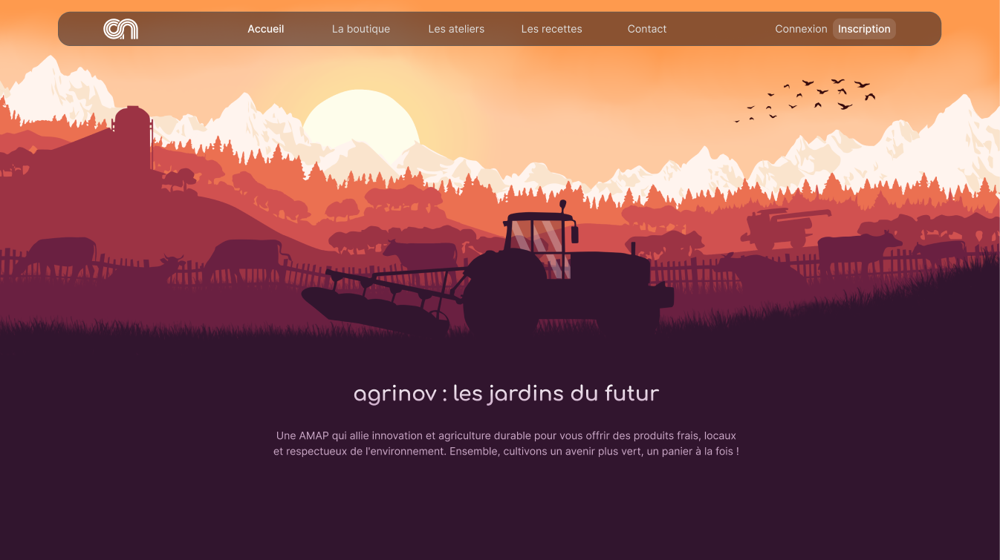

# Agrinov

**Agrinov** est un projet réalisé par une équipe de 5 développeurs pendant ma formation à ISIKA. Il s'agit d'une plateforme numérique dédiée aux **Associations pour le Maintien d’une Agriculture Paysanne** (AMAP), visant à faciliter la gestion des commandes et des échanges entre producteurs et adhérents. Le projet s'inscrit dans une démarche d'innovation pour rendre la gestion des AMAP plus fluide, accessible et conviviale.

## À propos du projet

Agrinov est situé à Clisson, dans les Pays de la Loire, et est une AMAP qui incarne des valeurs de solidarité, d'équité et de transparence pour soutenir une agriculture paysanne locale. Le partenariat direct entre producteurs et adhérents garantit des circuits courts tout en assurant une juste rémunération pour les producteurs.

### Objectifs principaux

- **Simplification de la gestion des AMAP :** Digitalisation de la gestion des commandes, des adhérents et des distributions.
- **Renforcer les liens entre producteurs et adhérents :** Organisation d'ateliers pour découvrir les savoir-faire des producteurs.
- **Améliorer l'accès à l'information :** Mise à disposition d'une plateforme numérique permettant aux adhérents de suivre les produits disponibles, de gérer leurs commandes et d'interagir avec les producteurs.

### Valeurs de l'AMAP
Agrinov repose sur des valeurs fortes de **solidarité**, **équité**, et **transparence**, avec l'objectif de renforcer les liens entre les producteurs locaux et les adhérents.

## Fonctionnalités

- **Gestion simplifiée des adhérents et des commandes :** Centralisation de la gestion via une plateforme numérique.
- **Automatisation des tâches administratives :** Inscription des adhérents, gestion des commandes et des cotisations.
- **Communication fluide entre les producteurs et les adhérents :** Suivi des produits, des méthodes de production, et organisation d'ateliers.

## Bénéfices de la digitalisation

La digitalisation des AMAP offre plusieurs avantages notables :

1. **Gestion plus fluide et flexible :** Une plateforme centralise toutes les informations et simplifie l'organisation des distributions et des commandes.
2. **Gain de temps :** L'automatisation des processus administratifs permet de consacrer plus de temps à l'essentiel, à savoir les interactions humaines et l'organisation d'activités conviviales.
3. **Amélioration de l'accessibilité et de la transparence :** La plateforme rend les informations plus claires et accessibles, facilitant la communication entre producteurs et adhérents.

## Technologies utilisées

### Stack technique

Le projet Agrinov a été développé en utilisant les technologies suivantes :

- **C# et ASP.NET MVC :** Pour le développement backend et l'architecture du projet.
- **HTML, CSS, JavaScript :** Pour la présentation et l'interactivité du frontend.
- **MySQL :** Pour le stockage et la gestion des données.

### Architecture

Nous avons utilisé le **pattern Model-View-Controller (MVC)** pour structurer l'application :

- **Model (M) :** Gère les données (adhérents, commandes, produits) avec MySQL.
- **View (V) :** Affiche les informations à l'utilisateur de manière claire et conviviale.
- **Controller (C) :** Gère les interactions utilisateur et les mises à jour entre le Model et la View.

### Détails techniques

- **14 tables de données**
- **Environ 12 000 lignes de code**
- **Versioning via GitHub**

### Répartition des langages utilisés

- **47,9% C#**
- **35,7% HTML**
- **13,9% CSS**
- **2,5% JavaScript**